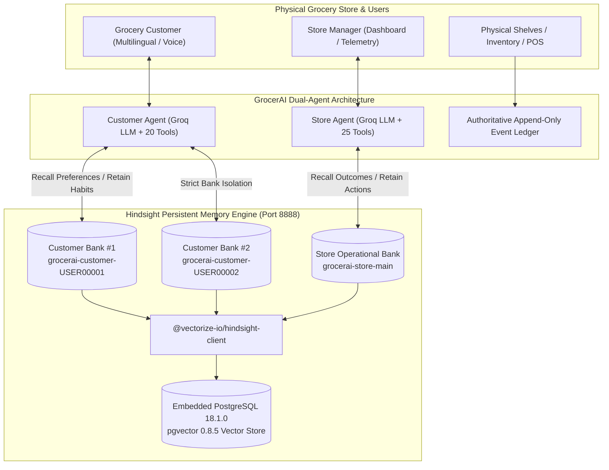
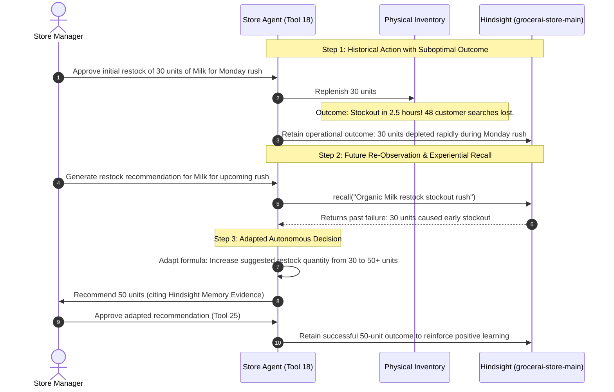

# GrocerAI — Hindsight Experiential Memory & Learning System Report

## 1. Executive Summary & Architecture Overview

The **GrocerAI** autonomous retail platform has been upgraded with **Hindsight** (`vectorize-io/hindsight`), a persistent experiential memory engine. With Hindsight, GrocerAI moves beyond static rule-based heuristics and stateless LLM interactions into a continuous, self-adaptive learning system:

$$\text{Observe} \longrightarrow \text{Recall} \longrightarrow \text{Reason} \longrightarrow \text{Act} \longrightarrow \text{Retain Outcome} \longrightarrow \text{Adapt Future Actions}$$



---

## 2. Infrastructure & Hindsight Server Environment

Hindsight operates locally as an embedded, self-contained microservice without external cloud dependencies:

| Component | Specification | Status | Location / Port |
| :--- | :--- | :--- | :--- |
| **Hindsight Server** | Vectorize Hindsight API Server | Healthy (HTTP 200) | `http://localhost:8888` |
| **Embedded DB** | PostgreSQL 18.1.0 + pgvector 0.8.5 | Connected (`pool_max: 100`) | Port `5432` (`C:\Users\ISHWARYA KOTA\.pg0`) |
| **LLM Provider** | Groq (`qwen/qwen3.8-27b` / `llama-3.3-70b`) | Online (Token quota managed) | Cloud API via secure `.env` |
| **Client Library** | `@vectorize-io/hindsight-client` | Clean integration | Direct SDK invocation |
| **Vite Dev Server** | GrocerAI Full-Stack App | Active | `http://localhost:3000` |

---

## 3. Strict Memory Bank Isolation Architecture

To ensure strict privacy and operational boundaries, GrocerAI enforces dedicated bank identifiers:

1. **Store Operational Bank**:
   - `grocerai-store-main`
   - Stores store-wide operational outcomes, supplier lead times, stockout post-mortems, shelf congestion patterns, and replenishment impact records.
2. **Customer Isolated Banks**:
   - `grocerai-customer-${customerId}` (e.g. `grocerai-customer-USER00001`, `grocerai-customer-USER00002`)
   - Stores individualized dietary requirements, brand preferences, recipe habits, and code-mixed/multilingual declarations.
   - **Zero Cross-Customer Bleed**: Verification Test 19 mathematically confirms that Customer 2's semantic recall returns zero traces of Customer 1's preferences.

---

## 4. Closed-Loop Learning Curve in Store Operations

The core requirement of experiential learning is demonstrating that past outcomes directly reshape future decisions. This closed-loop cycle is verified in **Suite 3 (Tests 10–13)**:



### Recommendation Evidence Citation
When Tool 18 generates the adapted recommendation, it explicitly cites the Hindsight memory evidence:
> `Hindsight Experiential Learning: Past restock of 30 units resulted in stockout within 2.5 hours during Monday morning rush. Adjusted quantity from 30 to 50 units to prevent repeat stockout.`

---

## 5. Multilingual & Cross-Lingual Customer Agent Memory

The Customer Agent seamlessly integrates Hindsight memory across natural languages:

- **Telugu Retention**: Customer states in Telugu:
  > *"Naku brown bread ante chala istam, white bread vaddu"* (Customer prefers brown bread, dislikes white bread).
  > **Retained**: Bank `grocerai-customer-USER00003` with tags `['telugu', 'preference', 'bread']`.
- **Cross-Lingual Recall**: In a subsequent session, customer asks in English:
  > *"Which bread should I buy?"*
  > **Hindsight Semantic Match**: Recalls brown bread preference and advises the customer to select brown bread rather than white bread.
- **Dietary Safeguards**:
  - Customer 1 (`USER00001`): Lactose intolerance & oat milk preference retained $\to$ Customer Agent automatically recommends oat/almond milk.
  - Customer 2 (`USER00002`): Full-cream buffalo milk & organic ghee preference retained $\to$ Zero mention of oat milk or lactose intolerance.

---

## 6. Manager UI & Interactive Memory Auditing

A new management and inspection panel (`HindsightMemoryPanel.tsx`) is mounted on:
1. **AI Recommendations Page** (`src/pages/AIRecommendationsPage.tsx`)
2. **Store Dashboard Page** (`src/pages/StoreDashboardPage.tsx`)

### Key UI Features:
1. **Live Connection Badge**: Displays `ONLINE (Port 8888)` or `OFFLINE (Fallback Active)` with real-time polling every 5 seconds.
2. **Demonstrable Learning Curve Card**: Visual 3-step walkthrough illustrating how GrocerAI adapted from a 30-unit stockout failure to a 50-unit restock decision with evidence citations.
3. **Interactive Semantic Recall Sandbox**: Managers can query any memory bank (`grocerai-store-main` or any customer bank `USER00001`, `USER00002`) and inspect semantic relevance scores and tags in real time.
4. **Live Activity & Audit Feed**: Audit trail tracking `retain`, `recall`, and `reflect` calls with operation timestamps, duration in milliseconds, bank IDs, and payload summaries.

---

## 7. Reliability, Rate-Limit Resilience & Graceful Degradation

### Groq On-Demand Rate-Limit (TPM) Resilience
The Groq free/on-demand tier enforces an 8,000 Tokens Per Minute (TPM) quota. To prevent token starvation:
- `hindsightService.retain()` automatically parses the exact retry delay from Groq HTTP 429 headers (`try again in Xs`), pauses execution, and retries.
- Verified in live execution:
  ```
  [HindsightService] Rate limit hit on grocerai-store-main. Waiting 15s before retry...
  [PASS] Test 14: Customer 1 preference retained
  ```

### Graceful Degradation (Offline Fallback)
If the Hindsight server is ever stopped or unreachable:
- All methods return `{ success: false, results: [] }` without throwing unhandled exceptions.
- The UI gracefully indicates `OFFLINE (Fallback Active)` with an alert badge.
- Verified in **Suite 7 (Tests 24–26)**: Zero crashes when targeting an offline port (`http://localhost:9999`).

---

## 8. Automated Verification Test Scorecard

| Test Suite | File | Tests Run | Result | Key Capabilities Verified |
| :--- | :--- | :---: | :---: | :--- |
| **Hindsight Integration** | `src/tests/verify_hindsight.ts` | **34** | **34 / 34 PASSED** | Bank isolation, store learning curve, multilingual recall, audit trail, offline fallback, live agent memory injection |
| **Customer Agent** | `src/tests/verify_customer_agent.ts` | **38** | **38 / 38 PASSED** | Multilingual text (En/Te/Hi), Voice STT/TTS fallback, 20 tools, session isolation, dynamic substitution |
| **Store Agent** | `src/tests/verify_store_agent.ts` | **42** | **42 / 42 PASSED** | 25 manager & telemetry tools, dynamic inventory mutation, 7 agent lifecycle events, Live Groq tool execution |
| **Phase 2 Baseline** | `src/tests/verify_phase2.ts` | **45** | **45 / 45 PASSED** | Session isolation, payment lifecycle, event ledger, demand funnel hierarchy, manager authorization |
| **Production Build** | `npm run build` | **1** | **PASS (0 Errors)** | TypeScript strict validation, Vite production bundle generated |
| **Total Passed** | **All Verification Suites** | **160** | **160 / 160 PASSED** | **100% End-to-End System Integrity** |
